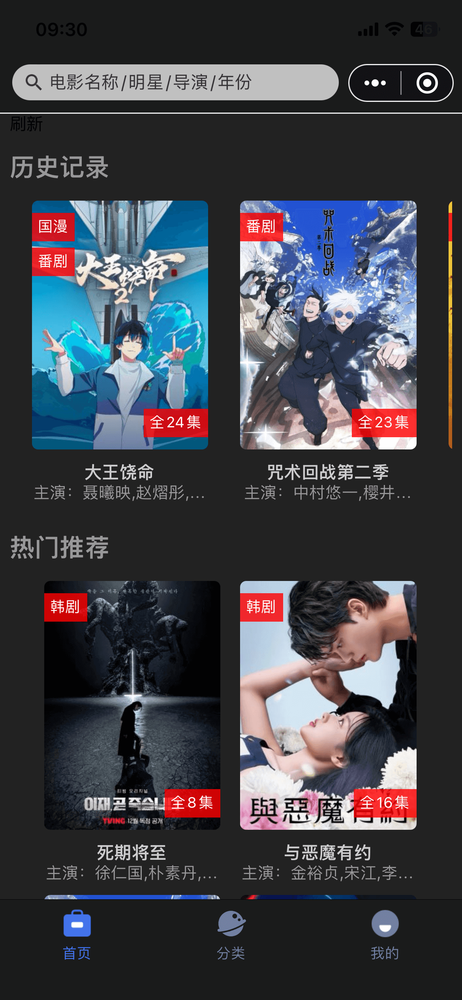
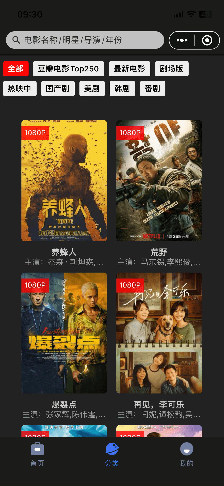
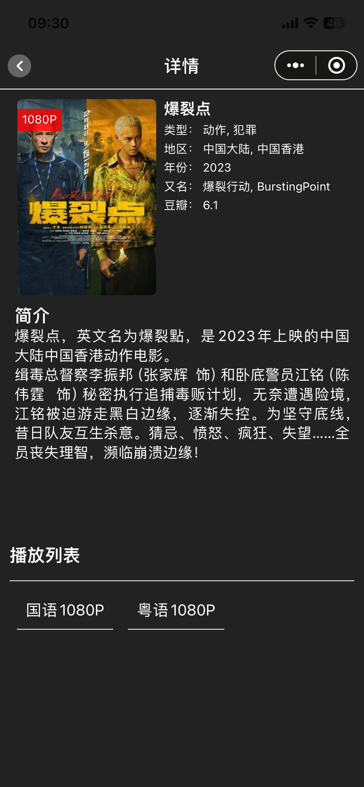
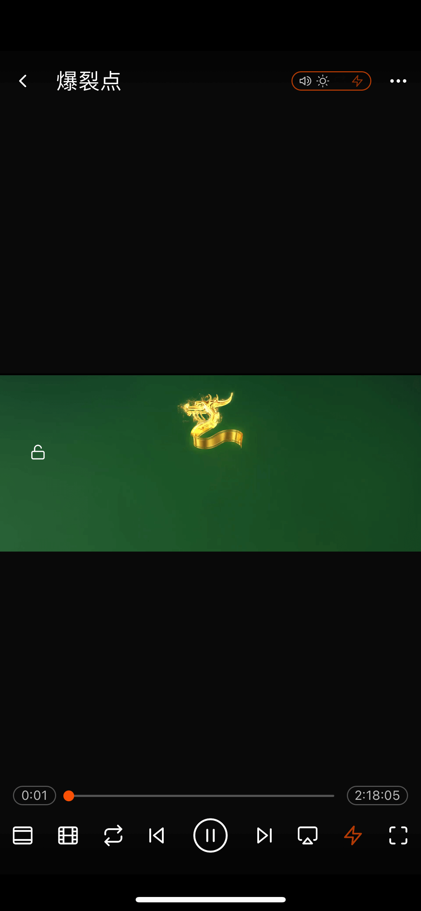

## [红糖云服app下载 https://mp.dagouzhi.com/ ](https://mp.dagouzhi.com/)

### 使用红糖云服app 扫码添加小程序

[](https://share.dagouzhi.com/#/pages/index/index?data=%7B%22type%22%3A%22app%22%2C%22name%22%3A%22%E7%94%B5%E5%BD%B1%E5%9F%BA%E5%9C%B0%22%2C%22projectname%22%3A%22%E7%94%B5%E5%BD%B1%E5%9F%BA%E5%9C%B0%22%2C%22appid%22%3A%22movie_996%22%2C%22appUrlConfig%22%3A%22https%3A%2F%2Fraw.githubusercontent.com%2Fhtyf-mp-community%2Fmovie%2Fmain%2Fdgz%2Fbuild%2Foutputs%2Fapp.json%22%2C%22zipUrl%22%3A%22https%3A%2F%2Fraw.githubusercontent.com%2Fhtyf-mp-community%2Fmovie%2Fmain%2Fdgz%2Fbuild%2Foutputs%2Fdist.dgz%22%7D)

>更多小程序demo 请查看[https://github.com/htyf-mp-community/demo](https://github.com/htyf-mp-community/demo)

## 预览

| 首页  | 搜索 | 详情 | 播放 |
| ------------- | ------------- | ------------- | ------------- |
|   |  |   |   |


## 开发步骤

### 1. 安装依赖,时入项目根目录

```shell
yarn
# ios
npm run ios
# android
npm run android
# H5
npm run dev:h5
# 微信小程序
npm run dev:weapp
# 红糖云小程序(选真机调试)
npm run dgz
```

## 注意事项

### 2. 开发时可按 taro 官方文档开发（不能使用相关ui库如`taro-ui`等）

> 注意
> [vscode 安装 stylelint 扩展](https://marketplace.visualstudio.com/items?itemName=stylelint.vscode-stylelint)
>
> 1. 所有样式名不能重复(最好以文件相对路径为前缀)，不能嵌套, 写法如普通 css. 具体可参考`注意 7`。
> 2. 引用资源请用此用法 `import xxpng from '@/assets/xxx.png';` 所有静资源放`@/assets`目录。
> 3. 为了更好的兼容性，禁用 css 背景图，所有图片以 image 标签写入到页面，可以用绝对定位来布局。
> 4. 定位只能支持用 position: absolute | relative。
> 5. 所有图片资源 禁用@2x @3x 等后缀。
> 6. border-radius 值必须为数字，圆形可以设置一个 99999px。
> 7. 可参考 taro 开发 react-native 文档 [`https://docs.taro.zone/docs/react-native-remind`](https://docs.taro.zone/docs/react-native-remind)
> 8. `box-shadow` css 阴影不能使用。
> 9. css 居中不能使用`margin: 0 atuo;`, 可用 flex 布局去居中。
> 10. 页面`index.config.ts`配置。

  ```javascript
    export default definePageConfig({
      navigationBarTitleText: '页面',
      backgroundColor: '#fff',
      // 禁滚动
      disableScroll: true,
      // 自定页面头
      navigationStyle: "custom",
    })
  ```

> 11. 设置文字`line-height`属性，注意防止与文字相关的布局紊乱。 
> 12. 但凡涉及文字，尽量使用`<Text></Text>`标签进行包裹。 
> 11. 页面头部组件使用自定义`import { Header } from '@/_UIHOOKS_';`
> 12. 页面如需要滚动使用`import { ScrollView } from '@tarojs/components'';`
> 13. 每个页面都规则模板(必须引入`<UIProvider>`)
```javascript
import {View } from '@tarojs/components'
import { Header, UIProvider } from '@/_UIHOOKS_';

function Index() {
  return (
    <View>
      
    </View>
  )
}
export default () => <UIProvider><Index /></UIProvider>
```
> 14. `_UIHOOKS_`目录里的为全局组件目录
> 15. `_UIHOOKS_/store`目录放redux相关业为, 全局存储状态都应放这统一面管理
> 16. `_UIHOOKS_`目录里的样式名规范： `uihooks-相对路径-具体类名`

### 3. 目录

```
@/_UIHOOKS_ // 公共组件/公共方法
@/_UIHOOKS_/store       // reudx store
@/assets      // 全局资源 
```

### 4. 打包

> 打包其它小程序按 taro 官方文档打包

> 如打包红糖云服小程序

```
npm run build:dgz
```

### 4. 上传运行红糖云服小程序

> 把打包出来的根目录 dgz/build/outputs 目录上传自己的 oss/cos 上

```
{
  "type": "app",
  "name": "RN模版",
  "projectname": "RN模版",
  "appid": "__rn_temp_appid__",
  "appUrlConfig": "https://raw.githubusercontent.com/htyf-mp-community/htyf-mp/main/mini-apps-template-rn/dgz/build/outputs/app.json",
  "zipUrl": "https://raw.githubusercontent.com/htyf-mp-community/htyf-mp/main/mini-apps-template-rn/dgz/build/outputs/dist.dgz"
}
```

并将以上 json 生成二维码就可以用红糖云服 app 扫码加入小程序

## 投食

开发迭代不易，觉得 App 好用的，有能力的请投喂一下，也可以给个星星

| 微信  | 支付宝 |
| ------------- | ------------- |
|   |  |