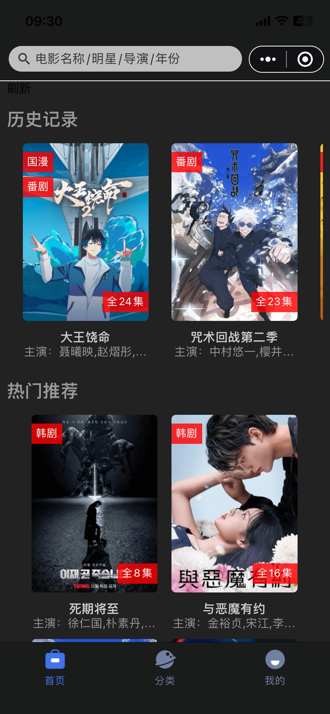
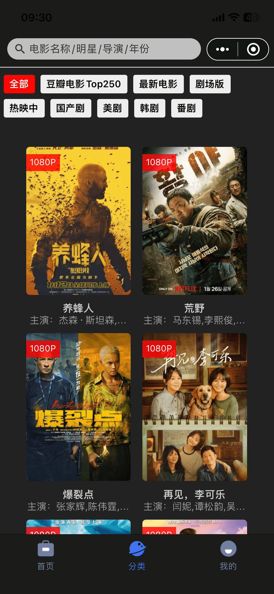
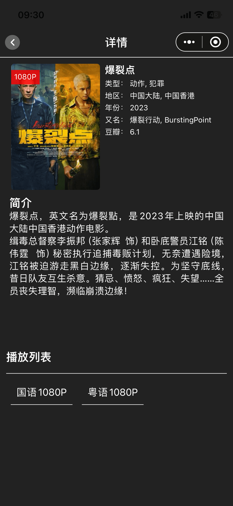

> ### ⚠ 说明
>
> 本仓库为 **红糖云服 App** 内的 **React Native 应用小程序**（电影）。需在宿主 App 中加载资源包，或按下方流程本地编译调试；分发与更新方式以 `app.json` 与官方文档为准。

<h2 align="center">电影</h2>

<p align="center">
  <a href="https://mp.dagouzhi.com/">红糖云服 · 小程序官网</a>
  &nbsp;·&nbsp;
  <a href="https://github.com/htyf-mp-community">GitHub 组织</a>
</p>

### 使用红糖云服app 扫码添加小程序

[](https://share.dagouzhi.com/#/pages/index/index?data=%7B%22type%22%3A%22app%22%2C%22name%22%3A%22%E7%94%B5%E5%BD%B1%E5%9F%BA%E5%9C%B0%22%2C%22projectname%22%3A%22%E7%94%B5%E5%BD%B1%E5%9F%BA%E5%9C%B0%22%2C%22appid%22%3A%22movie_996%22%2C%22appUrlConfig%22%3A%22https%3A%2F%2Fraw.githubusercontent.com%2Fhtyf-mp-community%2Fmovie%2Fmain%2Fdgz%2Fbuild%2Foutputs%2Fapp.json%22%2C%22zipUrl%22%3A%22https%3A%2F%2Fraw.githubusercontent.com%2Fhtyf-mp-community%2Fmovie%2Fmain%2Fdgz%2Fbuild%2Foutputs%2Fdist.dgz%22%7D)

>更多小程序demo 请查看[https://github.com/htyf-mp-community/demo](https://github.com/htyf-mp-community/demo)

## 预览

| 首页  | 搜索 | 详情 | 播放 |
| ------------- | ------------- | ------------- | ------------- |
|   |  |   |   |


## 开发步骤

### 1. 安装依赖,时入项目根目录

```shell
yarn
# ios
npm run ios
# android
npm run android
# H5
npm run dev:h5
# 红糖云小程序(选真机调试)
npm run htyf
```

### 2. 打包

> 如打包红糖云服小程序

```
npm run htyf
```

### 3. 上传运行红糖云服小程序

> 把打包出来的根目录 dgz/build/outputs 目录上传自己的 oss/cos 上

```
{
  "type": "app",
  "name": "RN模版",
  "projectname": "RN模版",
  "appid": "__rn_temp_appid__",
  "appUrlConfig": "https://raw.githubusercontent.com/htyf-mp-community/htyf-mp/main/mini-apps-template-rn/dgz/build/outputs/app.json",
  "zipUrl": "https://raw.githubusercontent.com/htyf-mp-community/htyf-mp/main/mini-apps-template-rn/dgz/build/outputs/dist.dgz"
}
```

并将以上 json 生成二维码就可以用红糖云服 app 扫码加入小程序

## 声明

本项目功能基于互联网上公开资料与学习交流目的开发。**严禁将本项目用于商业用途**；若用于红糖云服小程序分发，请同时遵守宿主平台与红糖云服的相关规则。

若您认为本仓库内容侵犯合法权益，请联系作者以便及时处理。

## Star History

<a href="https://www.star-history.com/#htyf-mp-community/movie&Date">
  <picture>
    <source media="(prefers-color-scheme: dark)" srcset="https://api.star-history.com/svg?repos=htyf-mp-community/movie&type=Date&theme=dark" />
    <source media="(prefers-color-scheme: light)" srcset="https://api.star-history.com/svg?repos=htyf-mp-community/movie&type=Date" />
    
  </picture>
</a>
